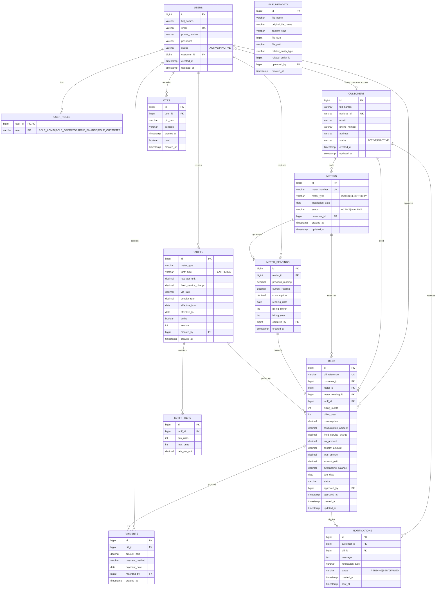

# Entity Relationship Diagram (ERD)

Utility Billing System — PostgreSQL relational schema for WASAC/REG postpaid billing.

## How to render

Copy the Mermaid block below into any of:

- [Mermaid Live Editor](https://mermaid.live)
- VS Code with a Mermaid extension
- GitHub/GitLab markdown preview

## Key constraints

| Constraint | Purpose |
|------------|---------|
| `customers.national_id` UNIQUE | Prevent duplicate customer registration |
| `meters.meter_number` UNIQUE | Prevent duplicate meters |
| `meter_readings (meter_id, billing_month, billing_year)` UNIQUE | One reading per meter per period |
| `bills (meter_id, billing_month, billing_year)` UNIQUE | One bill per meter per period |
| `bills.bill_reference` UNIQUE | Unique payment reference |

## Database triggers

| Trigger | Event | Action |
|---------|-------|--------|
| `bill_after_insert_notification` | AFTER INSERT on `bills` | Insert `BILL_GENERATED` notification |
| `payment_after_insert_update_bill` | AFTER INSERT on `payments` | Update balance/status; notify on full payment |
