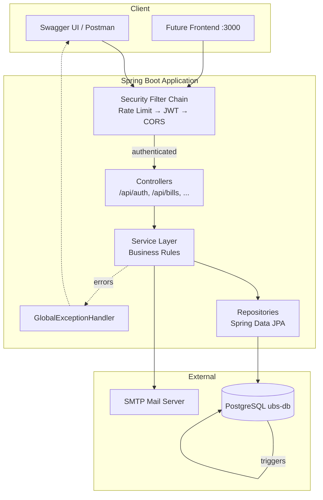
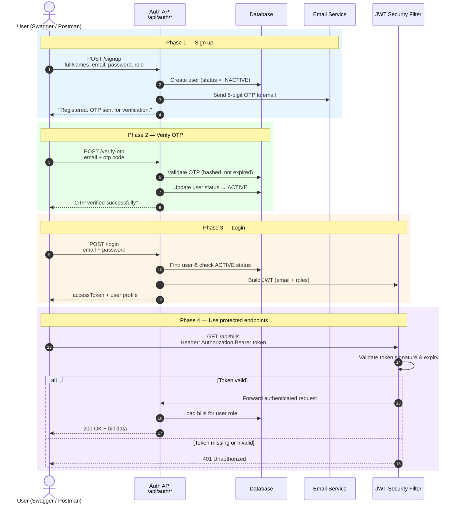
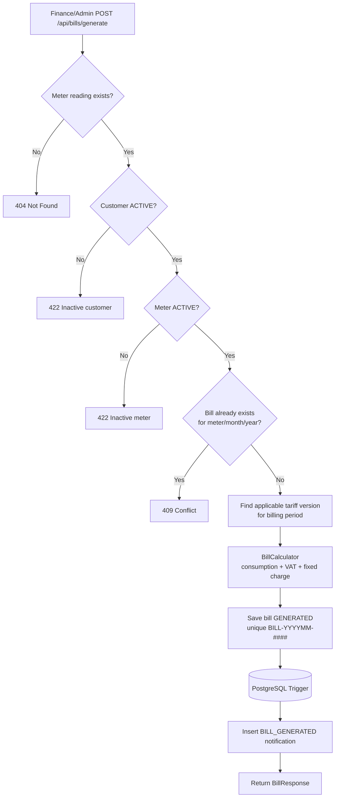
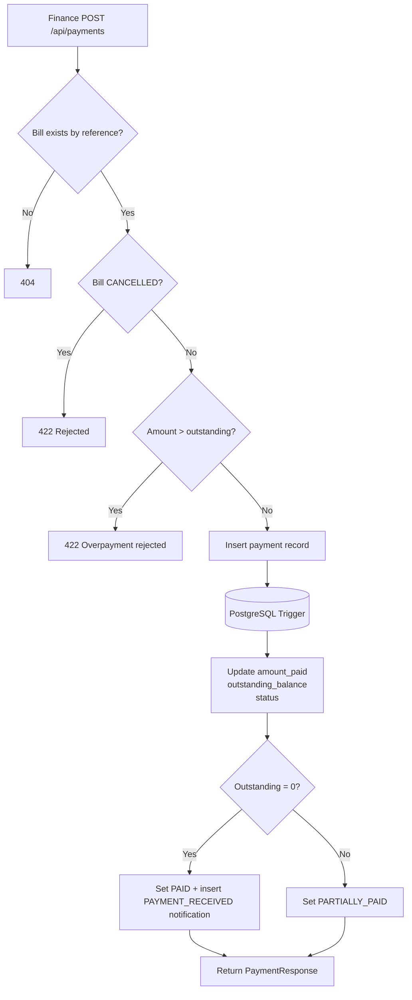
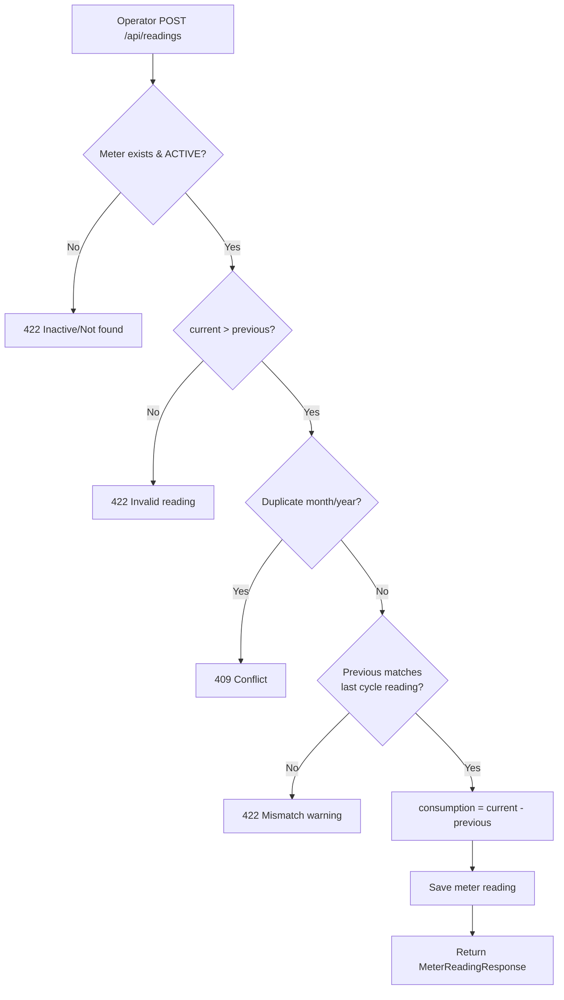
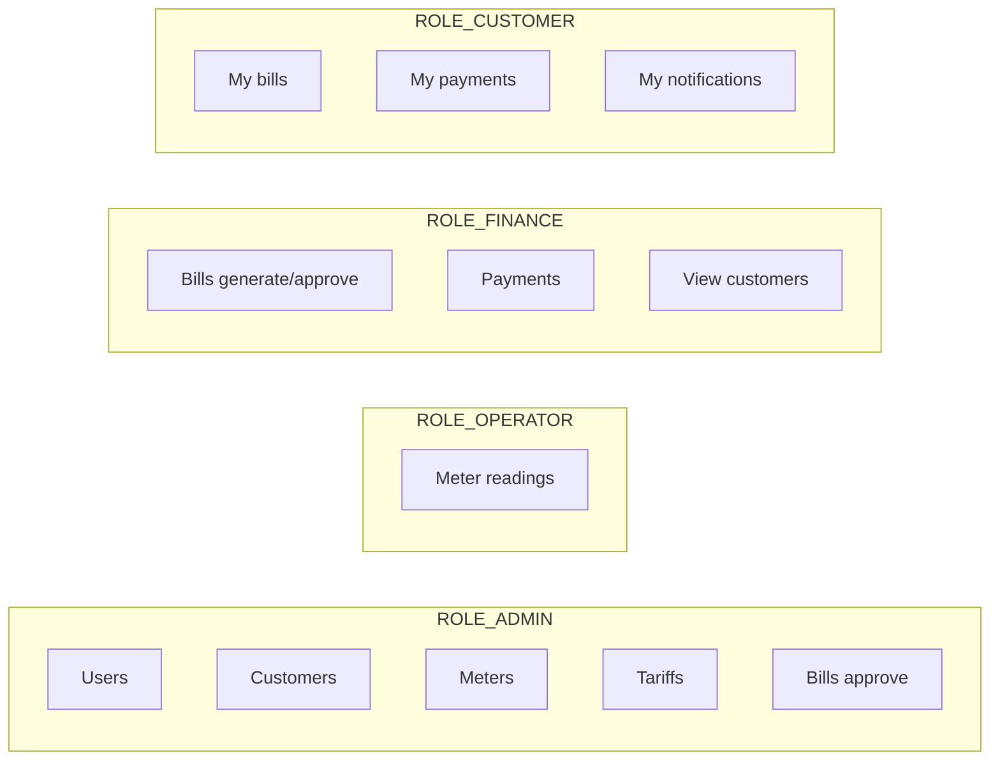

# Spring Boot Flow Diagrams

Utility Billing System request and business flows for WASAC/REG.

## How to render

Paste each Mermaid block into [Mermaid Live Editor](https://mermaid.live) and export as PNG/SVG.

---

## 1. Overall Spring Boot architecture



---

## 2. JWT authentication flow

How a new user registers, verifies their account, logs in, and accesses protected APIs.



---

## 3. Bill generation flow



---

## 4. Payment processing flow



---

## 5. Meter reading capture flow



---

## 6. Overdue penalty flow (scheduled)

```mermaid
flowchart TD
    A[@Scheduled daily job] --> B[Find bills past due_date<br/>with outstanding balance]
    B --> C{Penalty already applied?}
    C -->|Yes| D[Skip]
    C -->|No| E[penalty = outstanding × penalty_rate / 100]
    E --> F[Update penalty_amount, total_amount,<br/>outstanding_balance, status OVERDUE]
    F --> G[Log applied penalties]
```

---

## 7. Role-based access summary


