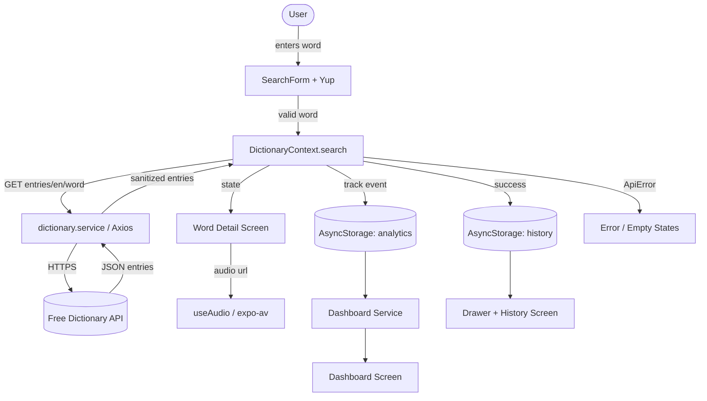
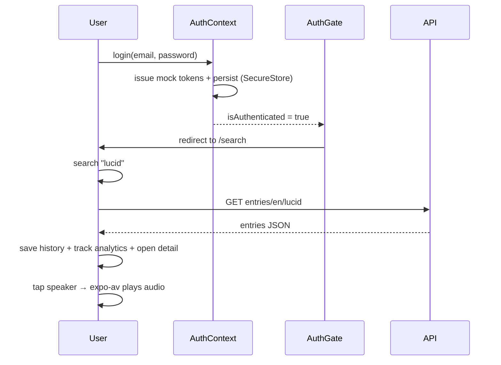

# LexiTech Dictionary — Architecture & Design Notes

## Data Flow Diagram (DFD)



## Application Architecture

```mermaid
flowchart TB
    subgraph Routing[Expo Router]
      RL[_layout: AppProviders + AuthGate]
      AUTH[(auth) stack]
      APP[(app) drawer]
    end
    subgraph State[Contexts]
      THEME[ThemeContext]
      AUTHC[AuthContext]
      PERM[PermissionContext]
      NOTIF[NotificationContext]
      HISTC[HistoryContext]
      DICTC[DictionaryContext]
    end
    subgraph Services[Service Layer]
      DSVC[dictionary.service]
      ASVC[auth.service - mock]
      DASHS[dashboard.service]
      ANS[analytics.service]
    end
    subgraph Lib
      HTTP[http: dictionaryClient + enterpriseClient]
      VAL[validation: Yup schemas]
    end
    RL --> State
    AUTH --> AUTHC
    APP --> DICTC
    DICTC --> DSVC --> HTTP
    AUTHC --> ASVC
    DASHS --> ANS
    PERM --> AUTHC
    State --> UI[Reusable Components + Screens]
```

## API Endpoint Mapping

| Feature | Method & Endpoint | Client | Auth |
| --- | --- | --- | --- |
| Word lookup | `GET /api/v2/entries/en/{word}` | `dictionaryClient` | None |
| Login / Register / Reset / Refresh | simulated | `enterpriseClient` (mock service) | Bearer (mock) |
| Dashboard analytics | local derivation from analytics events | n/a | mock RBAC |

## Screen List

`login`, `register`, `forgot-password`, `reset-password`, `search`, `word-detail`, `history`, `dashboard`, `settings`, `profile`, `+not-found`.

## Workflows



### Role-Based Access

| Permission | student | examiner | admin |
| --- | :---: | :---: | :---: |
| dictionary.search | ✓ | ✓ | ✓ |
| dictionary.audio.play | ✓ | ✓ | ✓ |
| history.view | ✓ | ✓ | ✓ |
| history.clear | | ✓ | ✓ |
| dashboard.view | | ✓ | ✓ |
| settings.manage | | | ✓ |
