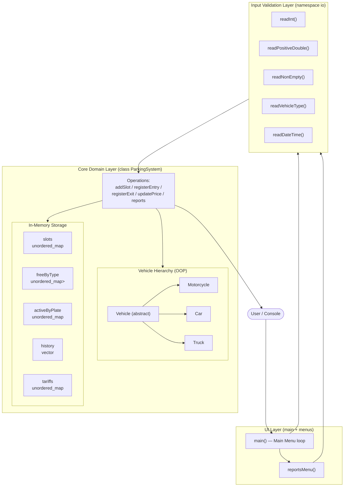
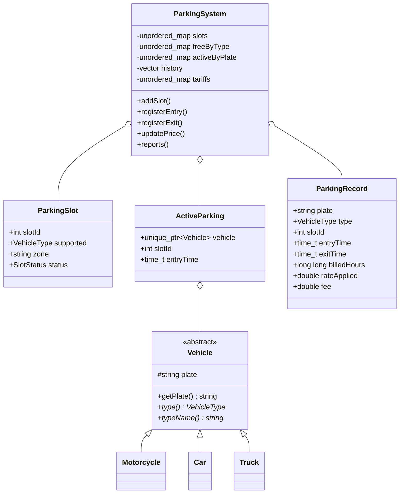
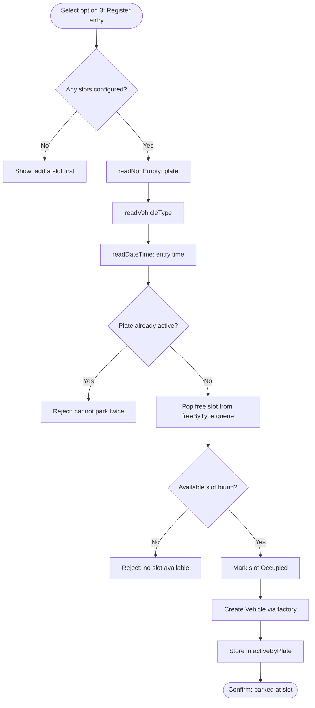
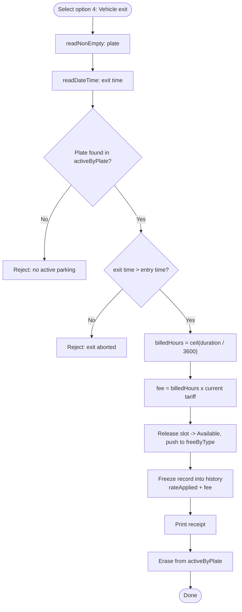
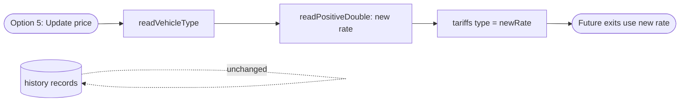
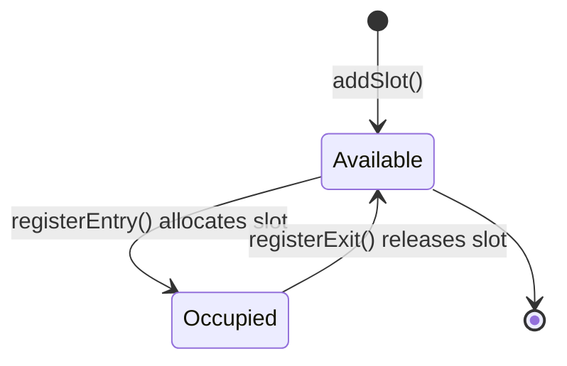

# System Architecture & Data Flow — Smart Parking Management System

This document describes how the Smart Parking Management System (`main.cpp`) is
structured and how data flows through it, using Mermaid diagrams.

---

## 1. High-level system architecture

The system is a single-process, in-memory C++ console application organised into
three layers: the **UI/menu layer**, the **input-validation layer**, and the
**core domain layer** (`ParkingSystem` + the `Vehicle` OOP hierarchy + storage).

---

## 2. Component responsibilities

---

## 3. Data flow — Vehicle Entry (Task 2)

---

## 4. Data flow — Vehicle Exit & Fee (Tasks 3 & 4)

---

## 5. Data flow — Price Update (Task 3 rule)

Price updates change only the live `tariffs` map; historical records keep the
rate that was frozen at exit time.

---

## 6. Overall state lifecycle of a parking slot

