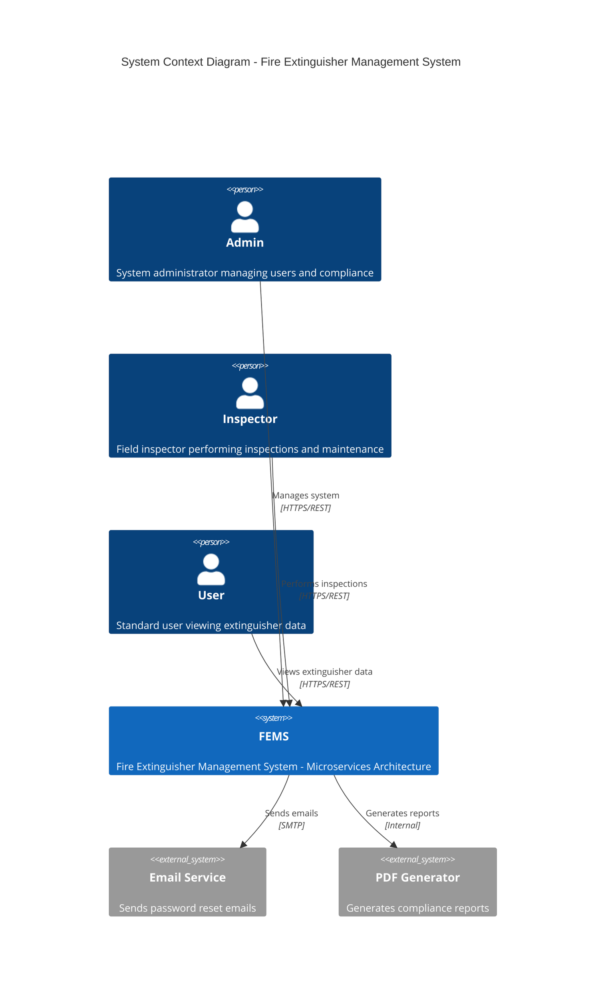
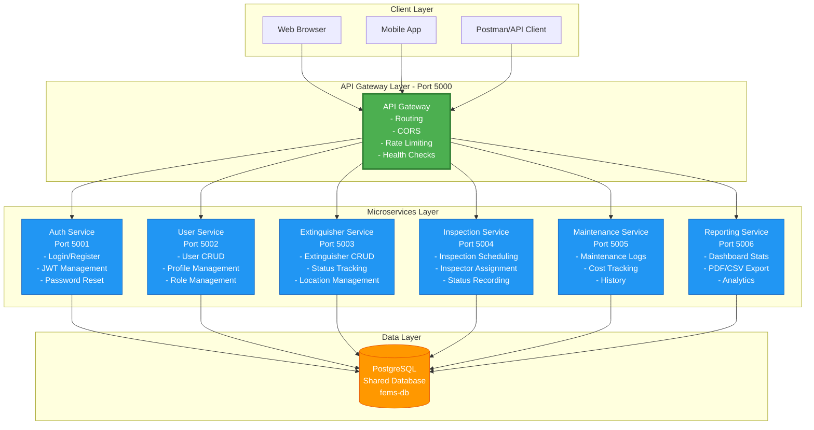
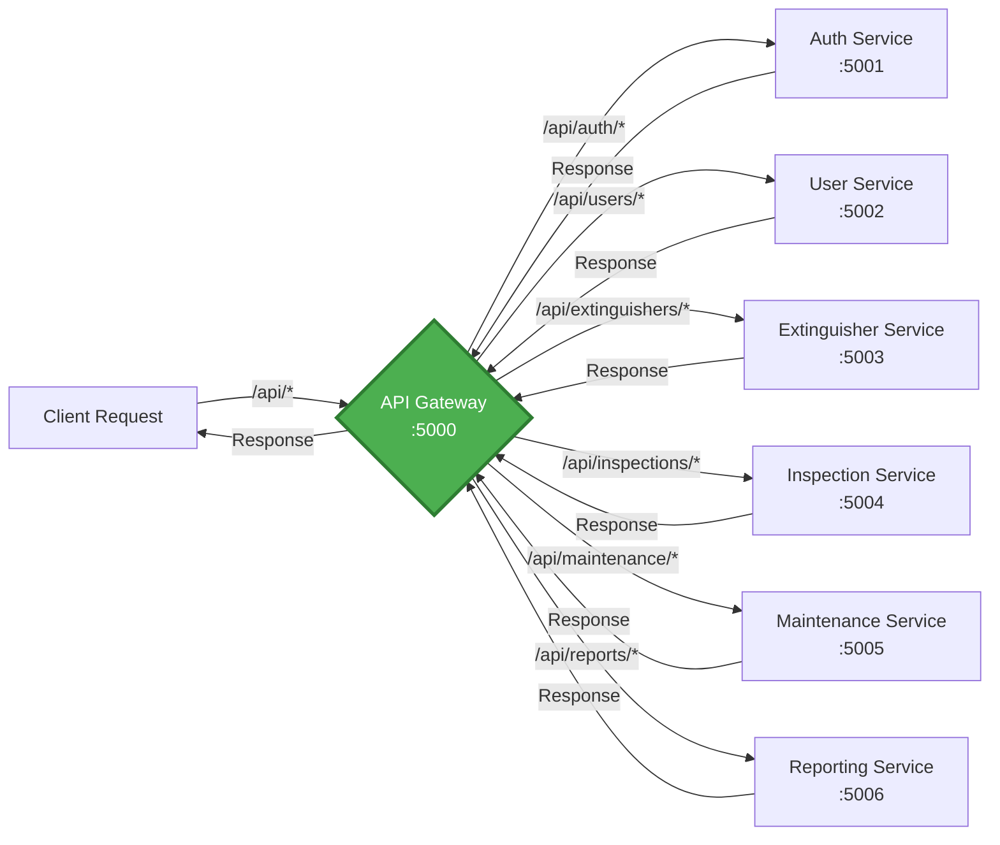
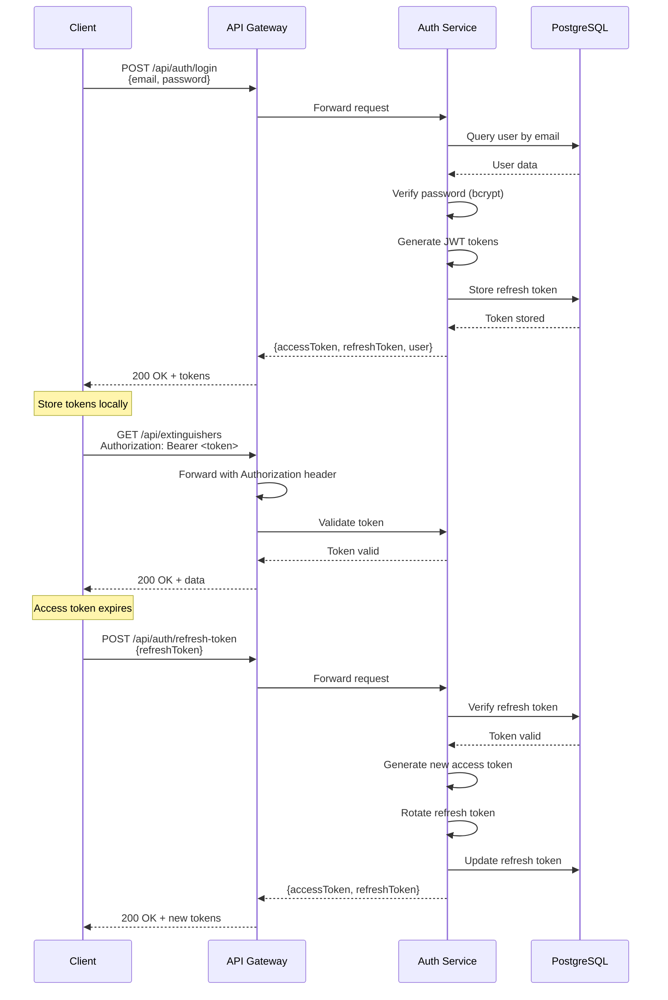
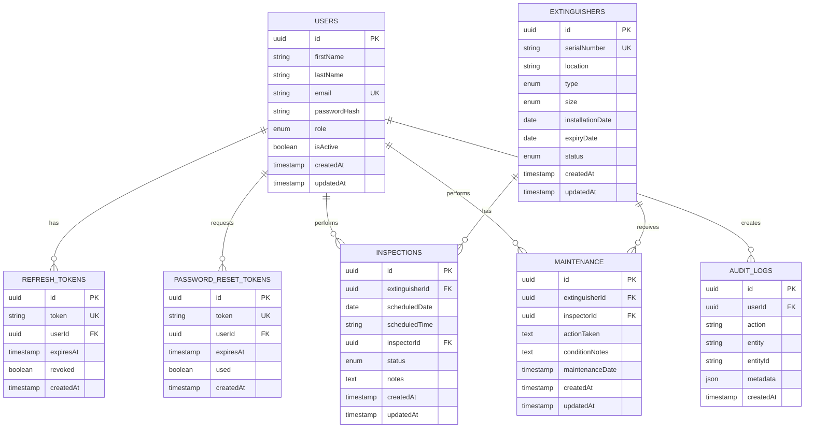
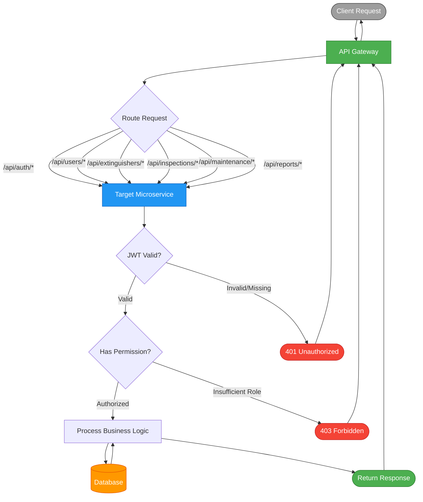
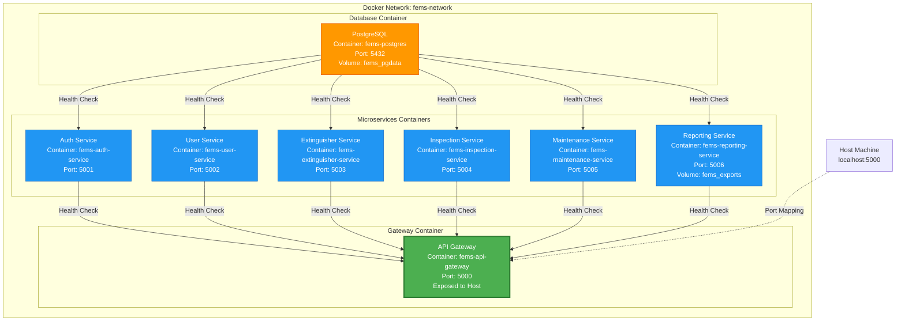
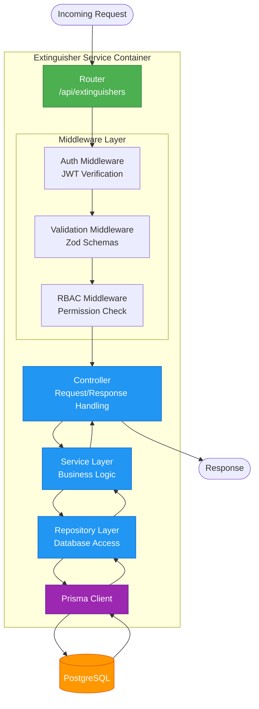
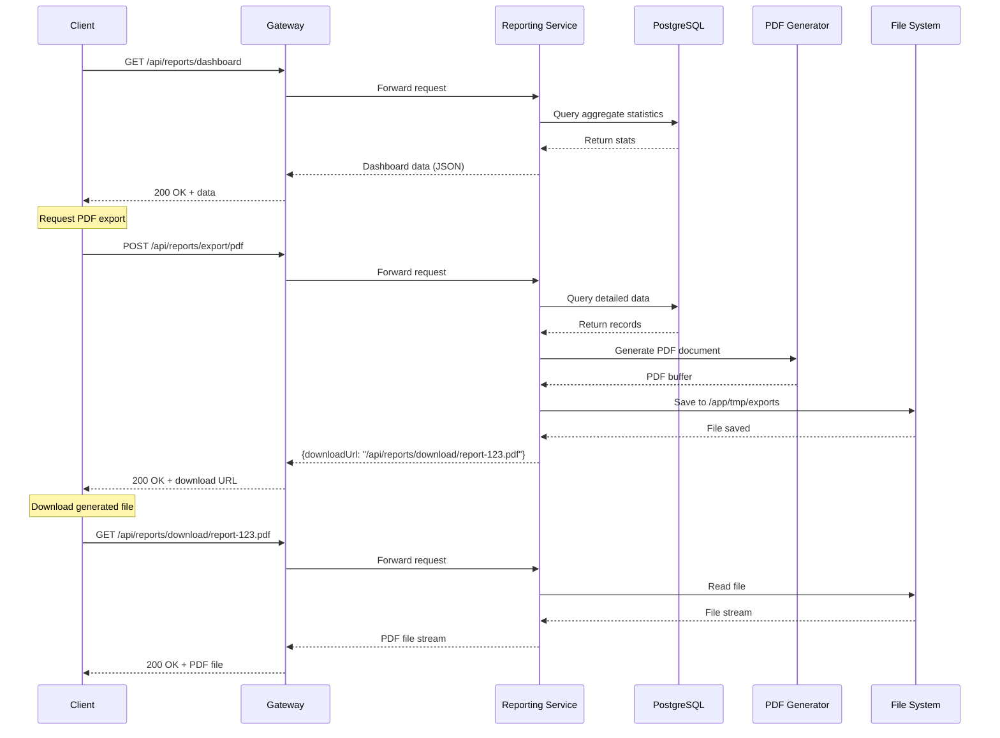
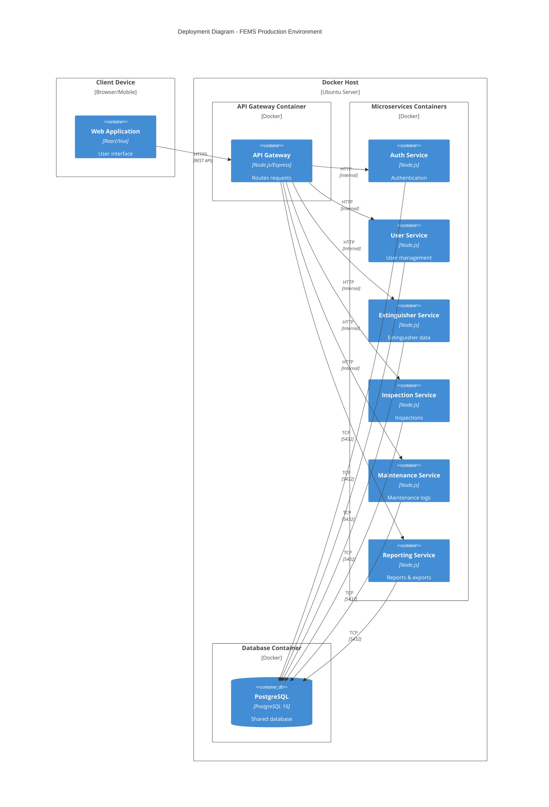

# FEMS Architecture Diagrams (Mermaid)

This document contains Mermaid diagrams for the Fire Extinguisher Management System (FEMS) microservices architecture.

---

## 1. System Architecture Overview (C4 Context Level)

---

## 2. Microservices Architecture (Container Level)

---

## 3. API Gateway Routing

---

## 4. Authentication Flow

---

## 5. Database Entity Relationships

---

## 6. Request Flow with RBAC

---

## 7. Docker Compose Deployment

---

## 8. Service Internal Architecture (Example: Extinguisher Service)

---

## 9. Reporting Service Data Flow

---

## 10. Deployment Architecture

---

## How to Use These Diagrams

### For dbdiagram.io (Database Diagram)
1. Go to https://dbdiagram.io
2. Copy the content from `DATABASE-DIAGRAM.dbml`
3. Paste into the dbdiagram.io editor
4. The ER diagram will be generated automatically
5. Export as PNG, PDF, or share the link

### For Mermaid Diagrams
These diagrams can be rendered in:
- **GitHub**: Paste into README.md (GitHub natively supports Mermaid)
- **GitLab**: Paste into any .md file
- **VS Code**: Install "Markdown Preview Mermaid Support" extension
- **Mermaid Live Editor**: https://mermaid.live
- **Documentation Sites**: Docusaurus, MkDocs, etc.

### Exporting Diagrams
- **Mermaid Live Editor**: Export as PNG/SVG
- **VS Code**: Right-click diagram → Export
- **Command Line**: Use `mmdc` (mermaid-cli) to generate images

---

## Architecture Highlights

### Microservices Benefits
- **Independent Scaling**: Each service can scale based on load
- **Technology Freedom**: Services can use different libraries/patterns
- **Fault Isolation**: One service failure doesn't crash the system
- **Team Autonomy**: Teams can own services end-to-end
- **Clear Boundaries**: Domain-driven service separation

### Shared Database Approach
- **Simplified Deployment**: No distributed transaction complexity
- **Data Consistency**: ACID guarantees at database level
- **Straightforward Migrations**: Single schema to manage
- **Future Evolution**: Can migrate to separate databases if needed

### API Gateway Pattern
- **Single Entry Point**: Centralized security and routing
- **Cross-Cutting Concerns**: CORS, rate limiting, logging at edge
- **Service Discovery**: Gateway knows all service locations
- **Client Simplification**: Clients only need one endpoint

---

## Related Documentation
- [MICROSERVICES.md](../MICROSERVICES.md) - Detailed architecture guide
- [MIGRATION-COMPLETE.md](../MIGRATION-COMPLETE.md) - Migration summary
- [DATABASE-DIAGRAM.dbml](./DATABASE-DIAGRAM.dbml) - Database schema for dbdiagram.io
- [README.md](../README.md) - Project overview and setup
