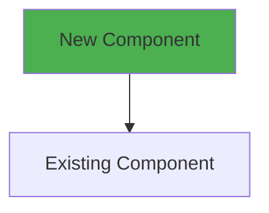

# Diagrams Quick Reference

This document provides quick instructions for using the FEMS architecture diagrams.

---

## 📊 Database Diagram (dbdiagram.io)

### File: `DATABASE-DIAGRAM.dbml`

**How to Use:**
1. Visit https://dbdiagram.io
2. Click "Go to App" or sign in
3. Copy the entire contents of `DATABASE-DIAGRAM.dbml`
4. Paste into the dbdiagram.io editor
5. The ER diagram will render automatically

**What You'll See:**
- All 7 database tables (users, refresh_tokens, password_reset_tokens, extinguishers, inspections, maintenance, audit_logs)
- Relationships between tables (one-to-many, foreign keys)
- Enums (Role, ExtinguisherType, ExtinguisherStatus, InspectionStatus)
- Indexes and constraints
- Table notes and documentation

**Export Options:**
- PNG image
- PDF document
- SQL export (PostgreSQL, MySQL, SQL Server)
- Share link

---

## 🎨 Architecture Diagrams (Mermaid)

### File: `ARCHITECTURE-DIAGRAMS.md`

Contains 10 different Mermaid diagrams showing various aspects of the system architecture.

### Rendering Options:

#### Option 1: GitHub/GitLab
1. Upload `ARCHITECTURE-DIAGRAMS.md` to your repository
2. View on GitHub/GitLab - Mermaid renders automatically
3. No additional tools needed!

#### Option 2: Mermaid Live Editor
1. Visit https://mermaid.live
2. Copy any diagram from `ARCHITECTURE-DIAGRAMS.md`
3. Paste into the editor
4. Export as PNG, SVG, or Markdown

#### Option 3: VS Code
1. Install extension: "Markdown Preview Mermaid Support"
2. Open `ARCHITECTURE-DIAGRAMS.md` in VS Code
3. Press `Ctrl+Shift+V` (Windows/Linux) or `Cmd+Shift+V` (Mac)
4. View rendered diagrams in preview

#### Option 4: Command Line Export
```bash
# Install mermaid-cli
npm install -g @mermaid-js/mermaid-cli

# Export diagram to PNG
mmdc -i input.mmd -o output.png

# Export diagram to SVG
mmdc -i input.mmd -o output.svg
```

---

## 📋 Available Diagrams

### 1. System Context (C4 Model)
**Purpose**: High-level view of system and external actors  
**Best For**: Stakeholder presentations, executive overview

### 2. Microservices Architecture
**Purpose**: Container-level view of all services  
**Best For**: Development team onboarding, architecture documentation

### 3. API Gateway Routing
**Purpose**: Request routing from gateway to services  
**Best For**: Understanding endpoint mapping, debugging routing issues

### 4. Authentication Flow
**Purpose**: Sequence diagram of login and token refresh  
**Best For**: Understanding JWT flow, implementing client authentication

### 5. Database Entity Relationships
**Purpose**: ER diagram showing table relationships  
**Best For**: Database design discussions, schema understanding

### 6. Request Flow with RBAC
**Purpose**: Flowchart of request processing with role checks  
**Best For**: Understanding middleware pipeline, debugging permission issues

### 7. Docker Compose Deployment
**Purpose**: Container orchestration and dependencies  
**Best For**: DevOps setup, understanding deployment architecture

### 8. Service Internal Architecture
**Purpose**: Layered architecture within a single service  
**Best For**: Understanding service structure, implementing new services

### 9. Reporting Service Data Flow
**Purpose**: Sequence diagram for PDF/CSV generation  
**Best For**: Understanding report generation, troubleshooting exports

### 10. Deployment Architecture (C4 Deployment)
**Purpose**: Production deployment view  
**Best For**: Infrastructure planning, deployment documentation

---

## 🎯 Quick Start

### For Database Visualization:
```bash
1. Open: https://dbdiagram.io
2. Load: backend/docs/DATABASE-DIAGRAM.dbml
3. View: Interactive ER diagram with relationships
4. Export: PNG/PDF for documentation
```

### For Architecture Visualization:
```bash
1. Open: https://mermaid.live
2. Load: backend/docs/ARCHITECTURE-DIAGRAMS.md (any diagram)
3. View: Rendered diagram
4. Export: PNG/SVG for presentations
```

### For Documentation:
```bash
# Add to your project documentation
1. Copy ARCHITECTURE-DIAGRAMS.md to your docs folder
2. Link from README.md
3. GitHub/GitLab will render Mermaid automatically
```

---

## 💡 Tips

### Database Diagram
- **Color Coding**: Tables are grouped by domain (auth, core, audit)
- **Relationships**: Arrows show foreign key relationships
- **Cascade Rules**: Hover over relationships to see delete rules
- **Export SQL**: Use exported SQL for database setup

### Mermaid Diagrams
- **Syntax**: Simple text-based syntax (easy to maintain)
- **Version Control**: Track diagram changes in Git
- **Customization**: Easy to modify colors, labels, layout
- **Integration**: Works with GitHub, GitLab, Confluence, Notion

### Best Practices
1. **Keep Updated**: Update diagrams when architecture changes
2. **Version Control**: Commit diagram source files (not just images)
3. **Documentation**: Link diagrams in README and wiki
4. **Presentations**: Export as images for PowerPoint/Google Slides

---

## 🔧 Customization

### Modify Database Diagram
Edit `DATABASE-DIAGRAM.dbml`:
```dbml
Table my_new_table {
  id uuid [pk]
  name varchar [not null]
  created_at timestamp [default: `now()`]
}

Ref: my_new_table.id > users.id
```

### Modify Mermaid Diagrams
Edit diagram syntax in `ARCHITECTURE-DIAGRAMS.md`:


---

## 📦 Export Formats

### dbdiagram.io Exports:
- ✅ PNG (high resolution)
- ✅ PDF (vector format)
- ✅ PostgreSQL SQL
- ✅ MySQL SQL
- ✅ SQL Server SQL
- ✅ Share link (public URL)

### Mermaid Exports:
- ✅ PNG (raster image)
- ✅ SVG (vector image - recommended)
- ✅ Markdown (with embedded diagram)
- ✅ HTML (standalone page)

---

## 📚 Resources

### dbdiagram.io
- Documentation: https://dbdiagram.io/docs
- Syntax Guide: https://dbdiagram.io/d
- Examples: https://dbdiagram.io/examples

### Mermaid
- Documentation: https://mermaid.js.org
- Live Editor: https://mermaid.live
- Syntax Guide: https://mermaid.js.org/intro/
- Examples: https://mermaid.js.org/ecosystem/integrations.html

### Tools
- **dbdiagram.io**: Free web-based ER diagram tool
- **Mermaid Live**: Free online editor for Mermaid diagrams
- **VS Code Extension**: Markdown Preview Mermaid Support
- **CLI Tool**: @mermaid-js/mermaid-cli (npm package)

---

## 🎓 Learning Resources

### Understanding the Architecture
1. Read `MICROSERVICES.md` for detailed architecture explanation
2. Review `MIGRATION-COMPLETE.md` for migration history
3. Examine diagrams to visualize concepts
4. Trace request flows through sequence diagrams

### For New Team Members
1. Start with Diagram #2 (Microservices Architecture)
2. Review Diagram #5 (Database ER Diagram)
3. Study Diagram #4 (Authentication Flow)
4. Explore service-specific diagrams as needed

### For Stakeholders
1. Present Diagram #1 (System Context)
2. Show Diagram #2 (Microservices Overview)
3. Use Diagram #10 (Deployment Architecture)

---

## ✨ Examples

### Generate PNG from Mermaid (Command Line)
```bash
# Extract a single diagram to temp file
cat ARCHITECTURE-DIAGRAMS.md | sed -n '/```mermaid/,/```/p' | head -n -1 | tail -n +2 > diagram.mmd

# Convert to PNG
mmdc -i diagram.mmd -o architecture.png -w 1920 -H 1080
```

### Embed in Documentation
```markdown
# System Architecture


See [Architecture Diagrams](./ARCHITECTURE-DIAGRAMS.md) for interactive versions.
```

### Include in Presentations
1. Export diagrams as PNG/SVG
2. Import into PowerPoint/Google Slides
3. Use for architecture presentations

---

## 🚀 Next Steps

1. **Visualize Database**: Load `DATABASE-DIAGRAM.dbml` in dbdiagram.io
2. **Review Architecture**: Open `ARCHITECTURE-DIAGRAMS.md` on GitHub or Mermaid Live
3. **Export Images**: Generate PNG/SVG files for documentation
4. **Share**: Add diagram links to project README
5. **Maintain**: Update diagrams when architecture evolves

---

## 📞 Support

For questions about:
- **Database Schema**: See Prisma schema files in each service
- **Architecture**: Read `MICROSERVICES.md`
- **Diagrams**: Refer to tool documentation (dbdiagram.io, mermaid.js.org)
- **Implementation**: Check service source code

---

**Last Updated**: June 3, 2026  
**Diagram Version**: 1.0.0  
**Architecture**: Microservices with API Gateway
